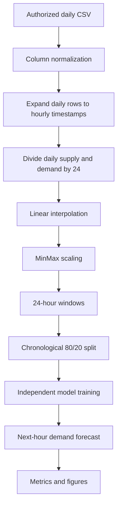

# Solar Energy Demand Forecasting

Comparative next-hour energy-demand forecasting with recurrent neural networks, convolutional
models, Random Forest, and XGBoost. This portfolio project recovers and organizes an Intelligent
Systems university project about solar-energy supply and demand in Saudi Arabia.

> **Data note:** the original university dataset may not be redistributable and is not included.
> The checked-in example is explicitly synthetic and is only for pipeline and test execution.

## 1. Overview

The project studies how the previous 24 hourly supply/demand values can be used to forecast demand
for the next hour. The recovered coursework pipeline started from daily records, expanded each
record across the 24 hours of its date, divided daily supply and demand by 24, then interpolated
available hourly columns. These values are uniform daily allocations, not measured hourly readings.

The cleaned code preserves the recovered model architectures and core windowing method, while
centralizing paths, data handling, scaling, evaluation, and plots. Methodology choices inherited
from the original work are documented rather than silently changed.

## 2. Problem

Given a 24-hour window of interpolated supply and demand, predict demand in the following row. Both
inputs are used; the supervised target is next-row `hourly_demand_interpolated`.

## 3. Project architecture



## 4. Dataset and provenance

The original module-supplied CSV and derived data are excluded. See [data/README.md](data/README.md)
and [docs/data-provenance.md](docs/data-provenance.md) for required columns, local placement, and
the data-sharing constraint. The sample under `data/sample/` is generated toy data and is not a
record of Saudi Arabia, Tabuk, or the historical observations.

## 5. Data pipeline

Place an authorized `hourlydailyenergy.csv` in `data/raw/`. The clean pipeline maps the original
`Date & Time`, `Daily Supply`, `Daily Demand`, and optional `Daily Mismatch` headings. Spreadsheet
weekly and unnamed columns are dropped. Processed output includes a timestamp, daily columns,
hourly allocations, and interpolated supply/demand columns.

## 6. Models

- LSTM
- Bidirectional LSTM
- CNN
- CNN-LSTM
- Random Forest
- XGBoost

Random Forest and XGBoost are fit and evaluated as **separate estimators**. They do not form an
ensemble. Model construction is in `src/solar_forecasting/models/`; the exact recovered scripts are
preserved separately under `legacy/original_scripts/`.

## 7. Evaluation methodology

The model inputs are two features over 24 time steps. Windows use rows `i` through `i+23` to predict
demand at `i+24`; the chronological test portion is the last 20%. The recovered scaler is fitted to
the full series before splitting, and neural models use the test portion as validation data. Both
choices can leak information into evaluation and are retained for methodological fidelity; see
[docs/methodology.md](docs/methodology.md).

Shared metrics are R², MAE, RMSE, and MAPE. MAPE omits actual values at or below `1e-8` in absolute
magnitude. Reproduced results include row counts, lookback, seed, and run timestamp.

## 8. Historical coursework findings

The original coursework report recorded this ranking: LSTM, BLSTM, Random Forest, LSTM-CNN,
Random Forest + XGBoost, CNN. This is reported as a historical finding only; evaluation code does
not hard-code or target that order.

## 9. Reproduced results

Historical outputs recovered from the original coursework environment. They are preserved for
provenance and are not presented as independently reproduced results. New local runs append metrics
to `results/reproduced/metrics/model_comparison.csv` and place figures under
`results/reproduced/figures/`. The recovered artifacts disagree in coverage and metric scale; see
[docs/results.md](docs/results.md). No reproduced metrics are included yet.

## 10. Example visualizations

Each run can save actual-versus-predicted demand, residuals, and error distribution figures. Neural
runs also save training/validation loss; tree models save feature importance. Figures are generated
locally and are ignored by Git by default.

## 11. Repository structure

```text
legacy/                 unchanged recovered source snapshots
src/solar_forecasting/  reusable data, sequence, evaluation, and model code
scripts/                preparation and training entry points
data/                   empty private-data locations plus synthetic sample
results/                separated historical/reproduced output locations
docs/                   methodology, results, provenance, reproducibility
report/                 report title and inclusion note; no PDF
tests/                  small synthetic tests; no network or neural training
```

## 12. Installation

Python 3.11 is recommended. Project metadata supports Python 3.11–3.12.

```powershell
py -3.11 -m venv .venv
.\.venv\Scripts\Activate.ps1
python -m pip install --upgrade pip
python -m pip install -e ".[dev]"
```

## 13. Running the project

Generate the tracked synthetic example again:

```powershell
python scripts/make_synthetic_sample.py
```

Prepare authorized coursework data:

```powershell
python scripts/prepare_data.py
```

Train one model on the prepared data:

```powershell
python scripts/train_random_forest.py
python scripts/train_lstm.py
```

To run all six architectures/estimators independently, use `python scripts/train_all.py`. Neural
training uses the recovered 50 epochs maximum, batch size 32, and early stopping patience 3.

## 14. Testing

```powershell
python -m pytest
```

Tests use synthetic frames and do not train neural networks.

## 15. Limitations

- Daily-to-hourly expansion creates uniform allocations rather than observed hourly values.
- Scaling is fitted before the chronological split; neural validation uses the test set.
- Historical metrics cannot be fully reconciled with the recovered scripts and checkpoint.
- The Global Solar Atlas file was not used by the recovered model scripts.
- No full six-model result table or original dependency lock was recovered.

## 16. Future work

- Reproduce experiments with an authorized dataset and record exact environment/configuration.
- Consider a train-only scaler and a separate validation split as a clearly labelled methodology
  experiment.
- Add weather/irradiance features only after data licensing and provenance are established.
- Revisit whether hourly observations can be sourced instead of uniformly allocated daily totals.

## 17. Project provenance

This repository is a cleaned and reproducible portfolio version of an Intelligent Systems
university project. The original source files were recovered from the coursework environment and
are preserved under `legacy/`. The modern implementation reorganizes the code for maintainability
and reproducibility without intentionally changing the original modelling methodology.

Historical coursework metrics and newly reproduced metrics are reported separately because the
recovered artifacts do not provide a fully consistent record of the original experimental
environment. The academic report PDF is not included; see `report/README.md`.
